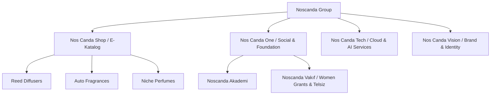

# Noscanda Corporate Portal

> [!WARNING]
> **STATUS: DISCONTINUED DEMO**  
> This repository is a discontinued demonstration model of the Noscanda Corporate Portal. It has been retired and is kept online solely for archive, reference, and demo purposes. No active updates or support will be provided.

---

## 📌 Project Overview
The **Noscanda Corporate Portal** serves as the central digital hub for the corporate identity, investment communications, educational academy, emergency response radio system, and product catalog representation of the Noscanda brand. It acts as an umbrella portal connecting various ecosystem arms under a unified, high-end presentation layer.

This platform showcase is designed using Google Antigravity premium design standards: flat light-mode ivory backgrounds (`#FAFAF7`), rich gold accents (`#B8860B`), glassmorphic panels, and high-performance scroll-driven animations.

---

## 🏗️ Brand Ecosystem



1. **Nos Canda Shop (E-Katalog)**: Showcases product details and notes (floral, fruity amber, etc.) with olfaction intensity pyramids. E-commerce checkouts are safely offloaded to the consumer storefront (`noscanda.net`).
2. **Nos Canda One (Foundation)**:
   - **Akademi**: Structured internship systems and university talent partnerships.
   - **Vakıf**: Emergency radio system (Telsiz), zero-waste initiatives, and grants for female entrepreneurs.
3. **Nos Canda Tech**: Service catalogs spanning cloud infrastructure, AI automation, cybersecurity audits, and full-stack development.
4. **Nos Canda Vision**: Digital agency portal for brand strategy, asset creation, and corporate positioning.

---

## 📁 Folder Structure

The project directory is structured as follows:

```
├── public/                 # Static assets (fonts, images, icons)
│   ├── fonts/              # Custom brand typography (farazdemo)
│   ├── kokular/            # Product olfactory visual assets
│   └── logolar/            # Corporate branding logo files
├── src/
│   ├── app/                # Next.js App Router (pages & routing layout)
│   │   ├── akademi/        # Akademi landing route
│   │   ├── e-katalog/      # Consolidated digital scent catalog
│   │   ├── girisimcilik/   # Franchise & partner validation forms
│   │   ├── iletisim/       # Corporate headquarters and application forms
│   │   ├── is-modellerimiz/# B2B, B2C, B2G Kamu Tedariği models
│   │   ├── kurumsal-bilgiler/ # Story, manifesto, and announcements
│   │   ├── olusumlarimiz/  # Tech, Vision, Shop, and One portals
│   │   ├── sections/       # Homepage page-structure section wrappers
│   │   └── yatirimci-iliskileri/ # Financial reports & governance details
│   ├── components/         # Premium UI component library
│   │   ├── core/           # Low-level primitives & interactive features
│   │   ├── globalsections/ # Desktop & mobile viewport sections
│   │   ├── layout/         # Shared layout (Navbar, Footer, OffCanvasMenu)
│   │   └── product/        # Specific widgets (pyramids, concentrations)
│   ├── hooks/              # Custom React hooks (GSAP triggers)
│   └── lib/                # Config files, constants, and structured data
├── next.config.ts          # Core server-side Next.js configurations & redirects
├── eslint.config.mjs       # Linting parameters
├── Dockerfile              # Container deployment recipe
└── package.json            # Script targets & framework versions
```

---

## 🛠️ Technology Stack

- **Core**: [Next.js v16](https://nextjs.org/) (App Router) & [React v19](https://react.dev/)
- **State & Data**: Strict [TypeScript](https://www.typescriptlang.org/) models (No `any` values)
- **Styling**: [Tailwind CSS v4](https://tailwindcss.com/) with light-mode custom color tokens (`ivory`, `gold`, `coal`)
- **Animations**: [GSAP](https://gsap.com/) & ScrollTrigger wrapped in React contexts for memory protection
- **Deployment**: Standalone node build containerized via Docker

---

## ⚙️ Local Development

### Prerequisites
- Node.js (v20+ recommended)
- `pnpm` package manager

### Getting Started

1. **Install Dependencies**:
   ```bash
   pnpm install
   ```

2. **Run Local Server**:
   ```bash
   pnpm dev
   ```
   Open [http://localhost:3000](http://localhost:3000) to view the development build.

3. **Production Compiling**:
   ```bash
   pnpm build
   ```

4. **Start Production Server**:
   ```bash
   pnpm start
   ```

5. **Lint Checking**:
   ```bash
   pnpm lint
   ```

---

## 🚢 Docker Deployment

The application features a standalone multi-stage Docker compilation.

Build the container image locally:
```bash
docker build -t noscanda-corporate .
```

Run the container instance:
```bash
docker run -p 3000:3000 noscanda-corporate
```

---

## 🔗 Redirect Configuration

Legacy paths are automatically routed server-side via `next.config.ts` to keep paths consistent and clean:
- `/urunlerimiz` ➔ `/olusumlarimiz/nos-canda-shop/urunlerimiz`
- `/e-katalog` ➔ `/olusumlarimiz/nos-canda-shop/e-katalog`
- `/dmo-katalogu` ➔ `/is-modellerimiz/b2g`
- `/felsefe` ➔ `/kurumsal-bilgiler/felsefe`
- `/hakkimizda/vakif` ➔ `/olusumlarimiz/nos-canda-one/vakif`
- `/vakif` ➔ `/olusumlarimiz/nos-canda-one/vakif`
